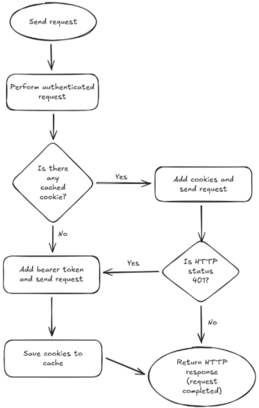

## 1. Current state

Previously, the RequestHandler class supported a single authentication mechanism based on user credentials (username/password). The flow was:
- Client initialized RequestHandler with user and password
- First request triggered an authentication call to /authentication/sign_in
- Server responded with session cookies (LWSSO_COOKIE_KEY)
- Cookies were stored in a CookieJar and automatically sent with subsequent requests
- On 401 errors, the handler attempted to reauthenticate once before retrying the original request
- All HTTP methods (GET, POST, PUT, DELETE) relied exclusively on cookie-based session management

## 2. Description

These modifications extend the `RequestHandler` class to support token-based authentication, a newly introduced authentication method in Octane. The implementation introduces a hybrid authentication strategy that allows clients to authenticate using either Bearer tokens or traditional username/password credentials.

When a token is provided, the handler can operate independently without requiring user credentials. In scenarios where both authentication methods are available, the system attempts cookie-based authentication first and automatically falls back to token authentication if the session expires or becomes invalid. This ensures seamless operation across different authentication contexts while maintaining full backward compatibility with existing credential-based implementations.

## 3. Design

### Authentication Flow

The diagram illustrates the decision-making process for the hybrid authentication mechanism. The flow begins when a client initiates any HTTP request through the `RequestHandler`.

**Initial Decision Point:**
Upon receiving a request, the handler first checks whether the client has previously authenticated and stored session cookies. This check determines the initial authentication strategy to employ.

**Cookie-Based Path:**
If cached cookies exist, the handler adds them to the request headers and sends the request to the server. The server processes the request and returns an HTTP response. At this point, the handler evaluates the response status code:

- **Success (non-401 status):** The cookies remain valid, and the response is returned to the client immediately. Any new cookies from the response are saved to the cache for future requests. This applies to all non-401 status codes (200, 400, 500, etc.), which terminate the flow and return the response as-is.

- **401 Unauthorized:** The session cookies have expired or become invalid. The handler recognizes this failure and initiates the fallback mechanism, redirecting the flow to token-based authentication.

**Token-Based Path:**
When no cookies are available (initial token-only authentication) or when cookie authentication returns a 401 status, the handler adds the Bearer token to the Authorization header and resends the request. The server validates the token and returns a response. Regardless of the outcome, any cookies returned in the response are saved to the cache, enabling future requests to attempt cookie-based authentication first. The HTTP response is then returned to the client, completing the request lifecycle.

This architecture provides flexibility by supporting three distinct authentication scenarios: credential-only (traditional cookie-based), token-only, and hybrid (graceful degradation from cookies to tokens).